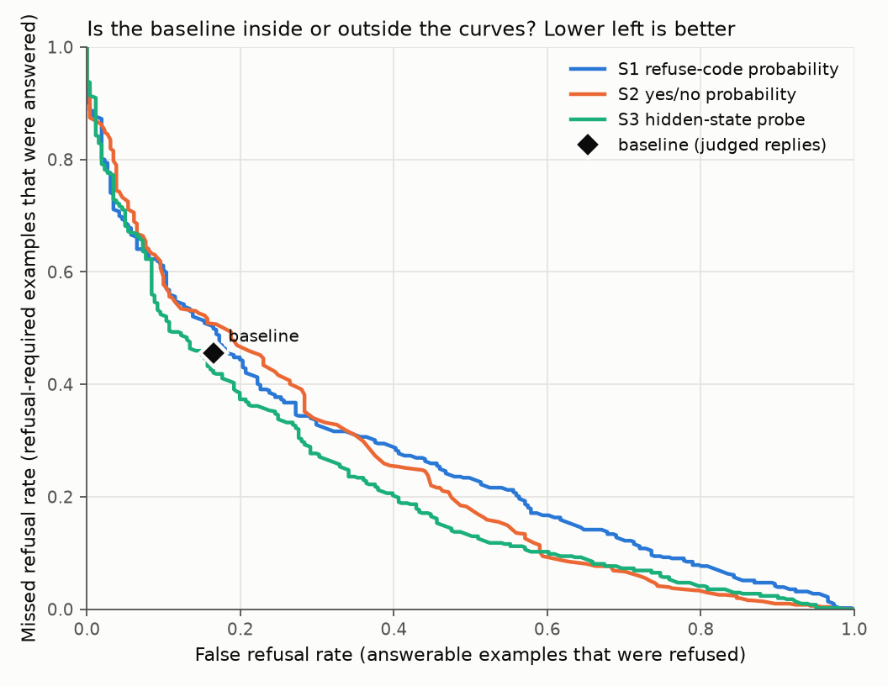

# Fair comparison: judged baseline vs Novelty 2 (auto-generated)

*Baseline run: `Benchmark-Baseline-Reproduction/qwen15_7b_baseline`. Baseline replies judged: 770 of 1560 generated (0 empty). Compared on 770 examples (509 refusal-required, 261 answerable) from 99 source questions. 95% intervals: cluster bootstrap over source questions, 2000 resamples.*

## Decisions side by side

| Rule | False refusal | Missed refusal | Balanced accuracy | Detection F1 | Uses labels? |
|---|---|---|---|---|---|
| **Baseline (judged replies)** | 0.165 [0.110, 0.222] | 0.456 [0.399, 0.515] | 0.690 [0.656, 0.724] | 0.668 [0.620, 0.712] | no |
| S1 default threshold (no labels used) | 0.103 [0.059, 0.153] | 0.580 [0.527, 0.635] | 0.658 [0.629, 0.687] | 0.571 [0.518, 0.618] | no |
| S1 tuned threshold | 0.261 [0.193, 0.335] | 0.397 [0.339, 0.455] | 0.671 [0.635, 0.705] | 0.695 [0.651, 0.733] | yes (cross-fitted) |
| S2 default (No > Yes, no labels used) | 0.115 [0.066, 0.168] | 0.546 [0.491, 0.601] | 0.669 [0.641, 0.699] | 0.600 [0.551, 0.646] | no |
| S2 tuned threshold | 0.337 [0.262, 0.415] | 0.326 [0.271, 0.381] | 0.668 [0.634, 0.703] | 0.730 [0.691, 0.765] | yes (cross-fitted) |
| S3 hidden-state probe | 0.276 [0.189, 0.365] | 0.289 [0.237, 0.342] | 0.718 [0.678, 0.756] | 0.768 [0.734, 0.798] | yes (cross-fitted) |

## Verdict per rule (balanced accuracy, rule minus baseline)

| Rule | Difference [95% CI] | Verdict |
|---|---|---|
| S1 default threshold (no labels used) | -0.031 [-0.057, -0.005] | **WORSE** |
| S1 tuned threshold | -0.018 [-0.047, 0.009] | **NO CLEAR DIFFERENCE** |
| S2 default (No > Yes, no labels used) | -0.020 [-0.047, 0.007] | **NO CLEAR DIFFERENCE** |
| S2 tuned threshold | -0.021 [-0.056, 0.014] | **NO CLEAR DIFFERENCE** |
| S3 hidden-state probe | 0.028 [-0.014, 0.065] | **NO CLEAR DIFFERENCE** |

BETTER = the whole interval is above 0. WORSE = the whole interval is below 0. NO CLEAR DIFFERENCE = the interval includes 0.

## Other differences (rule minus baseline)

| Rule | False refusal | Missed refusal | Detection F1 |
|---|---|---|---|
| S1 default threshold (no labels used) | -0.061 [-0.101, -0.025] | 0.124 [0.086, 0.162] | -0.098 [-0.133, -0.063] |
| S1 tuned threshold | 0.096 [0.053, 0.142] | -0.059 [-0.101, -0.019] | 0.026 [-0.005, 0.060] |
| S2 default (No > Yes, no labels used) | -0.050 [-0.098, 0.000] | 0.090 [0.045, 0.136] | -0.068 [-0.108, -0.032] |
| S2 tuned threshold | 0.172 [0.112, 0.241] | -0.130 [-0.183, -0.078] | 0.062 [0.024, 0.102] |
| S3 hidden-state probe | 0.111 [0.033, 0.192] | -0.167 [-0.232, -0.102] | 0.099 [0.054, 0.146] |

Negative is good for false and missed refusal, positive is good for F1.

## Read this before quoting a number

- The baseline is one sample per example at temperature 1.0 (as in the paper), so it carries sampling noise that the interval only partly covers. Qwen was 4-bit.
- The tuned thresholds and the S3 probe were fitted on the benchmark's labels (cross-fitted over source questions, so no example's own question was in its training data). The baseline gets no training. State this whenever the probe is compared with the baseline.
- The two default-threshold rules use no labels: they are the cleanest comparison with the baseline.
- The judge (Gemini) classifies free-text replies. A different judge could shift the baseline's numbers a little.
- Detection only: this says nothing about answer correctness or about naming the right refusal reason.

